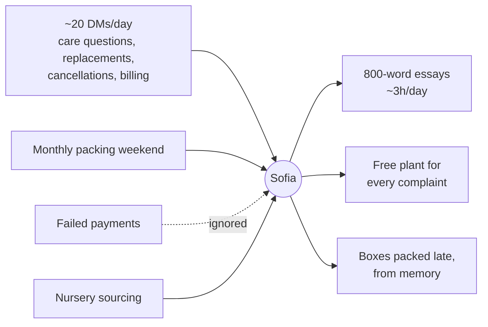
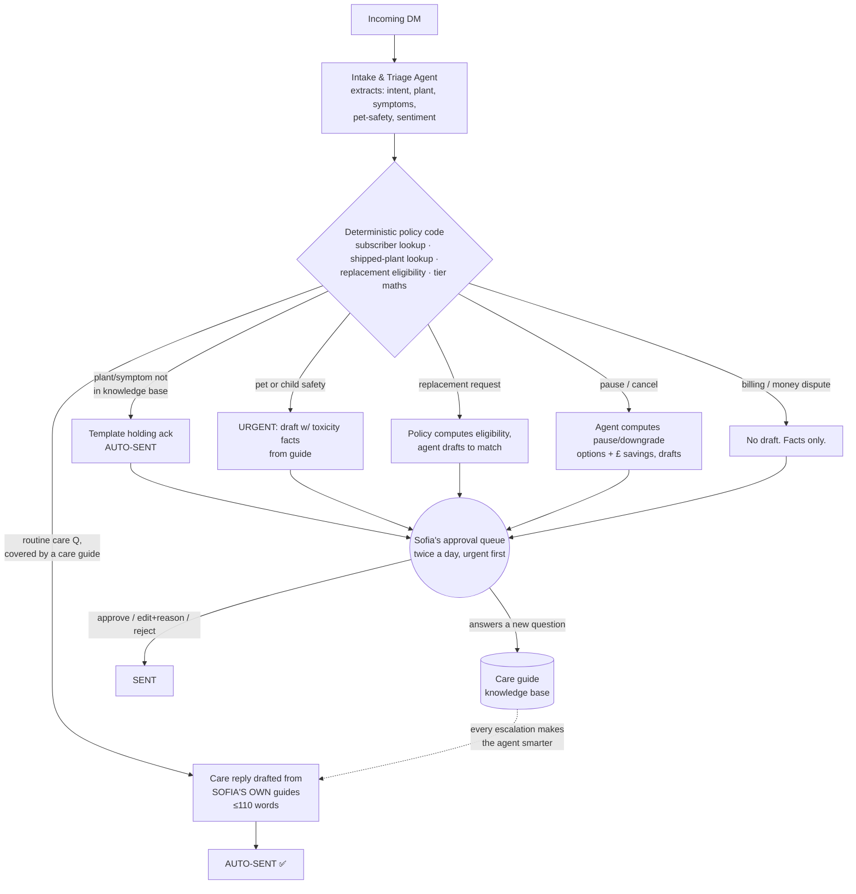

# The Map: how Rooted runs now vs. on autopilot

## The friend

**Sofia** runs **Rooted**: a houseplant subscription box. ~40 subscribers on three
tiers (Sprout £15/mo, Grower £29/mo, Jungle £49/mo), one packing weekend a month,
plants sourced from two nurseries, everything else through Instagram DMs.

**The twist, the two traits the system is designed around:**

1. **She can't give a short answer.** Every "why are my leaves yellow?" DM gets an
   800-word personal essay. It's why people love Rooted, and why she spends ~3
   hours a day re-typing the same monstera advice while boxes ship late.
2. **She's allergic to conflict.** Failed payments go unchased ("I'll mention it
   next month"), and every replacement request gets a free plant because saying
   no feels rude. She's effectively running an unlimited-free-plants policy she
   never chose.

## Before: everything is Sofia's phone

Every message type, regardless of stakes, gets the same treatment: Sofia, personally,
at essay length, eventually. High-stakes things (a cat chewing a toxic plant) wait
in the same queue as "how often do I water?".

## After: agents do the work, Sofia makes the calls

### The agent roster

| Agent | Owns | Autonomy | Never does |
|---|---|---|---|
| **Intake & Triage** *(built)* | Reading every DM; structured extraction; routing | Full, classification only, sends nothing | Answer anything itself |
| **Care Advisor** *(built)* | Care replies grounded in Sofia's guides | **Auto-sends** routine care answers; drafts-only for anything risky | Improvise botany not in a guide; touch money |
| **Policy Engine** *(built, plain code, deliberately not an agent)* | Subscriber/shipment lookup, replacement eligibility, tier maths, routing rules | n/a, deterministic | Everything: it's code, so money and facts are never left to a language model |
| **Retention & Billing** *(designed)* | Dunning sequence (2 gentle retries then escalate), pause/downgrade offers | Sends payment-retry nudges | Approve credits/refunds; conduct cancel conversations |
| **Box Curation** *(designed)* | Matching next box to each subscriber: pet-safe filter, no repeats, light conditions; drafts the personalised care card | Proposes the full manifest | Ship without Sofia's sign-off |
| **Ops** *(designed)* | Labels, "ships Tuesday" notifications, plant-specific care drip after each box | Full | n/a |

### Where humans approve

- **Anything touching money**, replacements, refunds, credits, billing disputes.
  The policy engine computes the *recommended* answer; Sofia one-taps it.
- **Pet/child safety**, the agent drafts instantly with toxicity facts from the
  guide, but a human sends it, marked urgent, top of the queue.
- **Retention**, pause/cancel conversations. The agent preps the options and
  exact £ savings; the relationship move is Sofia's.
- **Anything not in the knowledge base**, customer gets an instant holding ack;
  Sofia answers personally.

### What never gets automated, and why

| Never automated | Why |
|---|---|
| Final send on pet-safety replies | Wrong advice here harms an animal. The agent makes it *fast* (draft in seconds, urgent flag); the human makes it *safe*. |
| Refund/replacement/credit decisions | Money leaves the business only on a human decision. The policy makes the default fair so the decision is one tap, not a negotiation with Sofia's guilt. |
| Cancel/pause conversations | Retention at 40 subscribers is a relationship, not a funnel. An automated "sorry to see you go" email is how you lose subscriber #41's referral. |
| Writing the care guides | The guides ARE the product's expertise. Agents quote Sofia; they don't replace her. Every escalated question she answers becomes a new guide: the agent gets smarter without ever being allowed to invent. |
| Plant curation taste & nursery relationships | This is the business. Automate around it, never through it. |

### The human boundary, made operational

The map above says *where* Sofia stays in the loop. A companion prototype (a small
FastAPI + n8n layer, kept in [`production-reference/`](production-reference/)) works out
*how* that boundary holds once real webhooks, retries and a phone are in the picture.
Four of its rules are judgment calls about where the human sits, not plumbing details:

- **The plumbing is never allowed to make a judgment call.** The automation layer
  branches on one thing only: the decision the brain already emitted (`auto_send`,
  `ack_and_queue`, or `queue`). It never reads the customer's words, their intent, or
  the money in the message. The moment a piece of wiring needs to know what a customer
  *said*, the design has failed and judgment has leaked out of the brain.
- **Autonomy can only narrow toward Sofia, never widen away from her.** A kill switch
  demotes a model-written auto-send into Sofia's queue, keeping the draft rather than
  dropping it. Nothing anywhere can do the reverse and promote a queued item to an
  auto-send. Autonomy contracts toward the human on its own; only a human widens it back.
- **When quality slips, control returns to the human automatically.** A daily eval
  sentinel re-runs the quality gate. The first time it fails, auto-send suspends itself
  and Sofia is alerted. Turning autonomy back on is a deliberate human act, never an
  automatic "it passed again today." The system may hand power back; it may never take it.
- **The approval queue is a phone, not a dashboard.** Sofia approves, edits or rejects
  from Telegram. Approving is one thumb; overriding the policy costs a typed reason, the
  same friction that turns her guilt into a speed bump instead of a loophole.

These four are built and unit-tested, but the live stack was never stood up (an honest
status note lives in the folder's README). They sit in the map, not an appendix, because
each one is a decision about *where the human belongs* once the toy becomes a system.

### How the design accounts for Sofia specifically

| Sofia's trait | Structural countermeasure |
|---|---|
| 800-word essays on everything | Hard 110-word cap in the drafting rules + "offer to go deeper". Her depth becomes **opt-in** for the customer instead of a tax on every reply. Her past essays become care guides: written once, reused forever. |
| Can't say no (free plants for everyone) | The **policy** computes the replacement answer before Sofia sees the message. Approving the recommendation is one keypress; *deviating* from it requires editing the draft and **typing a reason**. The default path is the fair path: her guilt now has friction, her policy doesn't. |
| Ignores failed payments | Dunning is a sequence, not a confrontation: the agent sends the gentle nudges, and Sofia only enters at step 3, by which point most cases have resolved themselves. |

### The one design principle

> **The LLM writes words. Code owns facts, money and dates.**
>
> The model never computes a price, decides an eligibility, or asserts which
> plant a customer owns. Code looks those up and hands the model the answer to
> phrase. And the model never states a plant-care fact that isn't in Sofia's own
> guides. If the guide doesn't cover it, the rule is "Sofia will follow up",
> not improvisation.
