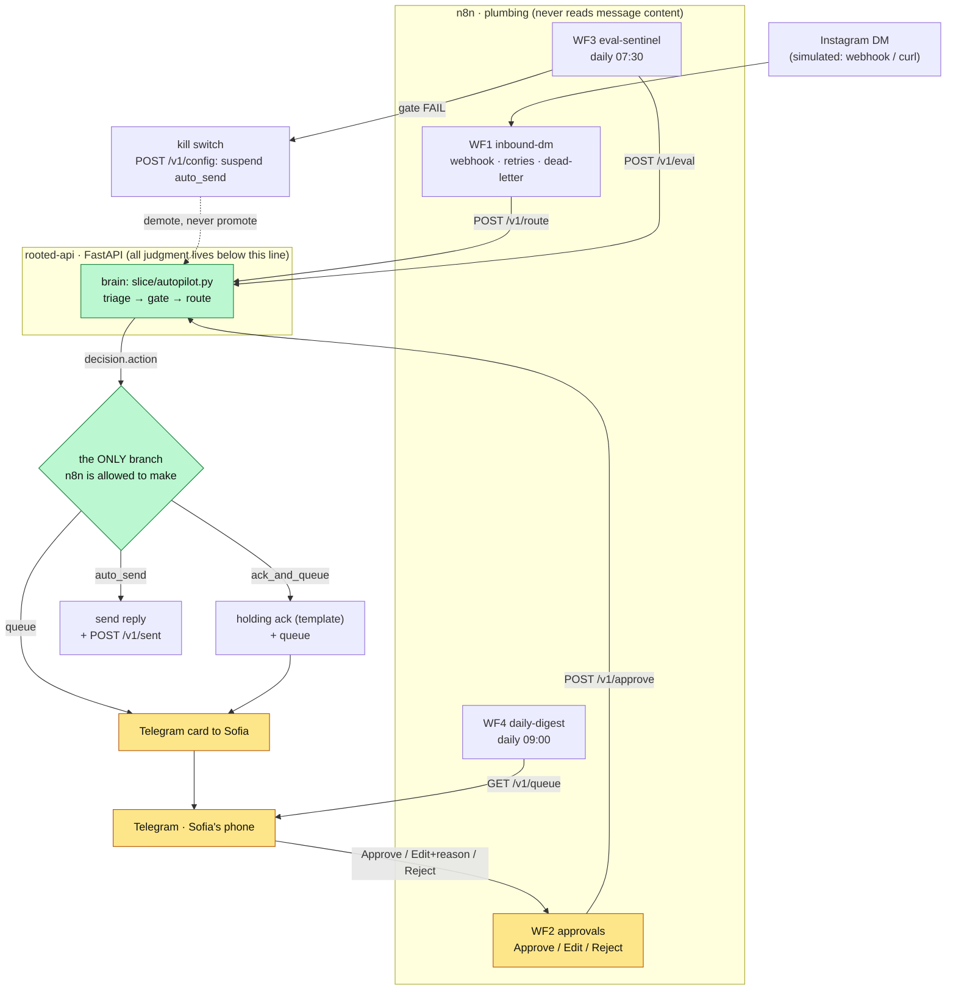

# Production reference: the automation layer

> **Read this first: what this folder is, and is not.**
>
> 1. **What it is.** A working prototype of how Rooted would run *in production*: a small
>    FastAPI service (**rooted-api**) that exposes the brain's decisions, plus four n8n
>    workflows (webhooks, Telegram human approvals, cron, retries and dead-letters) and a
>    fifth self-contained Telegram demo you can text. It reimplements none of the brain's
>    judgment; it wires the brain into real channels.
> 2. **It is NOT required to evaluate the slice.** The working slice runs standalone
>    from the repo root (`cd slice && python3 autopilot.py …`, zero dependencies). Nothing
>    in this folder needs to run for the slice to be judged. This is the "what I'd build
>    next", already built one layer deep.
> 3. **Honest status.** The code is unit-tested (52 mocked tests, zero network — `pytest`
>    → 52 passed on a clean checkout), but the **live stack was never stood up**: Docker
>    Desktop was wedged on the build machine, so `docker compose up`, the n8n import and
>    the Telegram round-trip were never exercised end to end. Treat the workflow JSON and
>    the API as a reviewed design with passing unit tests, not a running system. The suite
>    imports the brain straight from this repository's `slice/` — no vendoring, no setup step.
>
> **Two guard tests were retired at consolidation** (`test_frozen_original_untouched`,
> `test_vendored_clone_stays_git_clean`). They enforced a boundary that no longer exists:
> when this was a separate repo, the brain was a frozen artifact vendored at a pinned SHA
> and the service was forbidden to touch it. Folding both into one repository dissolves
> that boundary on purpose, so those two now assert an invariant we deliberately dropped.
> The decision is recorded in a visible note in `service/tests/test_adapter.py` rather than
> hidden behind a deleted failing test.

This layer wraps the working slice's *decisions* in a FastAPI service (**rooted-api**)
and n8n workflows that own webhooks, Telegram approvals, cron, retries and dead-letters,
plus a self-contained Telegram demo you can text, without reimplementing a single line of
the brain. It began as a separate repo that vendored the slice as a frozen artifact; it
now lives beside the slice as `production-reference/`.

```
                Instagram DM (simulated: webhook / curl / paste)
                                   │
                        ┌──────────▼───────────┐
                        │  n8n  WF1 inbound-dm  │   owns: webhook, retries,
                        │  respond {ok} first   │   dead-letter, Telegram fan-out
                        └──────────┬───────────┘
                    POST /v1/route │  (switch ONLY on decision.action)
                        ┌──────────▼───────────────────────────────┐
                        │            rooted-api  (FastAPI)          │
                        │  adapter.py ── imports ──► autopilot.py    │
                        │  route/approve/queue/eval/config/sent      │   the brain: ../slice
                        │  one threading.Lock · append-only audit    │   (same repo, same commit)
                        └──────────┬───────────────────────────────┘
             auto_send │ ack_and_queue │ queue │ duplicate
        ┌──────────────┘        │            │
        ▼                       ▼            ▼
  placeholder send        holding ack   Telegram card to Sofia
  + POST /v1/sent         (template)    ✅ Approve ✏️ Edit ❌ Reject  ─► WF2 ─► /v1/approve

  WF3 eval-sentinel (daily 07:30): POST /v1/eval → on non-PASS, POST /v1/config to
                                   suspend auto-send + alert Sofia.
  WF4 daily-digest  (daily 09:00): GET /v1/queue → Telegram summary.
```

### The workflow graph (rendered)

The same picture as a flow graph. The one thing to see: **everything n8n does hangs
off a single `Switch` on `decision.action`**, and all judgment lives below the API
line. The human (yellow) is reached only through the queue; the kill switch only ever
demotes.



## Demo: text the bot, get the AI's reply

The quickest way to watch the brain work is **WF5**
(`workflows/05-telegram-demo.json`): a self-contained round-trip where **you DM a
Telegram bot as if you were a customer, and the AI's own reply comes straight
back to that chat.** Telegram stands in for the Instagram customer channel so the
whole loop is visible in one window.

| You DM the bot | What comes back, in the same chat |
|---|---|
| *"my monstera has a couple of yellow leaves, am I overwatering?"* | The **care reply**, sent automatically (`auto_send`). A routine question the brain is confident to answer. |
| *"my fiddle-leaf fig keeps dropping leaves since I moved flat, any ideas?"* | The **hand-off message** comes back instantly, then the item is queued for Sofia (`ack_and_queue`): *"Hey [name]! Great question, this one deserves a proper answer, so I'm passing it straight to Sofia to look at personally. She'll get back to you within a day. 🌿"* |

The customer is acknowledged in seconds and the human never loses the thread.
Same boundary rule as production: WF5 switches only on `decision.action` and
relays the brain's text, never the customer's words. Setup is one BotFather bot
(about 2 min, `docs/n8n-setup.md` §6); activate WF5 on its own, since Telegram
allows one webhook consumer per bot token.

## The boundary rule (the whole point)

**n8n never inspects message text, intent, sentiment, lane names, or money.** Its
only routing branch is a `Switch` on `decision.action`: a three-value enum the
Python brain emitted (`auto_send | ack_and_queue | queue`), plus the `duplicate`
replay case. `queued.urgency` may change notification *cosmetics* (the `‼️`
prefix) only, never routing. If an n8n node ever needs to know what a customer
*said*, the design has failed. All judgement lives in the brain; n8n is
plumbing.

## Demote-never-promote

The plumbing may **narrow** autonomy, never widen it. The kill switch
(`POST /v1/config {"auto_send_enabled": false}`) demotes a model-written
auto-send to Sofia's queue: the draft, which *passed* the gate, is moved to
`held/` and queued as `NEEDS_SOFIA`, `killswitch_applied: true`. Nothing anywhere
can turn a `queue`/`ack_and_queue` into an `auto_send`. The deterministic holding
ack in `ack_and_queue` still sends when the switch is on, because no model wrote
it. The switch suspends *model-written sends only*. There's an explicit on/off
test matrix for this invariant.

## How it maps to the brain

`adapter.py` is the only module that touches the brain. It:
- imports `autopilot` straight from this repository's `slice/` — same commit as
  the service by construction, so there is nothing to vendor and no SHA to pin
  (via an stdout shim: autopilot calls `sys.stdout.reconfigure()` at import,
  which pytest capture can choke on),
- redirects `autopilot.QUEUE_FILE` / `OUTBOX` into `service/data/` so the
  brain's tree is never written to,
- folds `route()`'s action list into the API decision shape,
- applies the kill switch.

Every prompt, lane decision (`decide_lane`), draft gate (`validate_draft`) and
the holding-ack text run from the slice's own file. The **only** re-implemented lines
are the ~10 file-writing lines of `cmd_review`'s approve/edit outbox format.
That CLI is interactive and can't be called programmatically, so mirroring its
exact `To:/Status:` format is plumbing, not brain.

## API (all `/v1/*` require `X-Api-Key`; `/healthz` is open)

| Endpoint | Purpose |
|---|---|
| `POST /v1/route` | route a DM → decision; idempotent per `message_id` (stored decision replay = `duplicate:true`; the crash window 409s) |
| `POST /v1/approve` | approve / edit / reject a queue item. Friction-by-design lives here: edit & reject require a reason; approve needs a draft (422s otherwise); edit runs `validate_draft` and returns non-blocking `warnings` |
| `GET /v1/queue` | pending items, urgent first, with counts |
| `POST /v1/eval` | run the brain's eval subprocess; gate from **exit code**, scores parsed from stdout; 409 if already running |
| `GET/POST /v1/config` | the `auto_send_enabled` kill switch (flag-file backed; re-enabling is deliberately manual) |
| `POST /v1/sent` | audit-only delivery confirmation from n8n |
| `GET /healthz` | `brain_ok`, `data_dir_writable`, `anthropic_key_present`, `auto_send_enabled`; 503 if the brain path is missing |

## Quickstart

```bash
cp .env.example .env          # add ANTHROPIC_API_KEY; ROOTED_API_KEY via: openssl rand -hex 24
docker compose up -d          # rooted-api :8000, n8n :5678 (the brain is ../slice, bind-mounted)
curl -s localhost:8000/healthz | python3 -m json.tool
```

Then `docs/n8n-setup.md` for the Telegram bot + workflow import, `RUNBOOK.md` for
operating it, and `workflows/SIMULATE.md` to drive the whole loop by curl.

Tests (fully mocked, zero network): `pytest` → 52 passed. (The repo's
`pyproject.toml` already sets `-q`; adding your own `-q` goes double-quiet and
hides the count line.)

## Honest wrinkles (known, deliberate, documented, not hidden)

- **Single-worker lock.** FastAPI's sync handlers run in a threadpool, so every
  queue/decision/flag mutation holds one module-level `threading.Lock`, and the
  container runs `--workers 1` (load-bearing: the lock is only authoritative in
  one process). This is right for ~40 subscribers; SQLite with row locks is the
  move if it ever grows.
- **Fixture clock.** `LIVE_CLOCK=0` pins the brain's "today" to 2026-07-01 so
  replacement-window maths matches the committed fixtures reproducibly.
  Production sets `LIVE_CLOCK=1`.
- **Telegram edit state is a demo-grade hack.** The two-step edit (text, then
  reason) is carried in the Telegram reply-to chain, not a database. The Code
  node walks `message.reply_to_message`. Fine for one operator; don't
  productionise it.
- **String couplings to the brain.** `"holding ack"` substring in the
  send detail; the `\n\n` outbox header split; the `From: @` first line; the eval
  stdout line formats. All are safe *because* the brain and the service ship in
  the same commit and every coupling is covered by a contract test. If the slice
  changes, the tests are the tripwire.
- **The "send DM" node is a placeholder.** WF1/WF2 log the payload in a Code node
  where the real Instagram/Meta channel node slots in later.
- **Model tier is an open trade-off.** The brain defaults to `claude-opus-4-8`;
  the "why Opus at £15/mo" cost question is deliberately left open, not silently
  changed.

## Repo layout

```
service/     rooted-api: settings, adapter (touches the brain), app, audit, evalrunner, tests
workflows/   the five n8n JSON files (4 production + 05 Telegram demo) + SIMULATE.md (built by scripts/build_workflows.py)
scripts/     build_workflows.py, validate_workflows.py, smoke_live.sh
docs/        n8n-setup.md
```

The brain itself is `../slice` — the same working slice a reviewer runs from the
repo root, imported directly. Service and brain are the same commit by
construction; there is no vendored copy and no pinned SHA to drift or orphan.

## Hard constraints honoured

The brain's tree is **never written to** by the service: the adapter redirects
every queue/outbox write into `service/data/` (the eval cache,
`slice/eval/.triage_cache.json`, is the one documented exception). No brain
logic is reimplemented. No live LLM calls in pytest.
